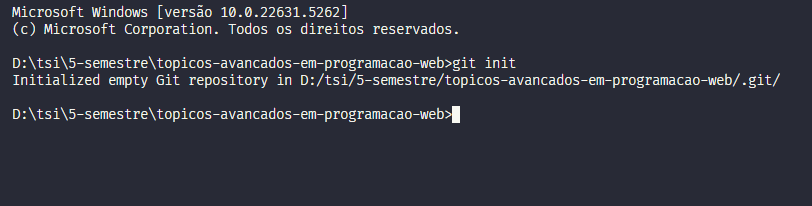
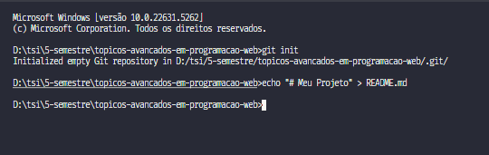
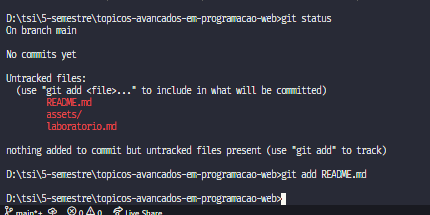
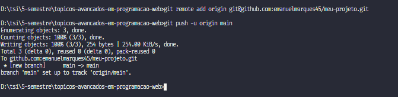
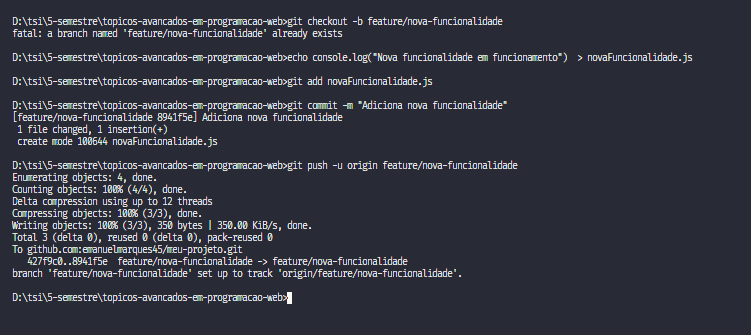
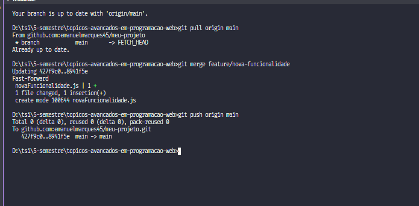

## Configuração global

]

## Inicialização do repositório local

## Criação do arquivo README.md

## Adição e commit do arquivo ao repositório

## Push do arquivo ao repositório remoto

## Criação de nova branch

## Mesclagem das duas branches

